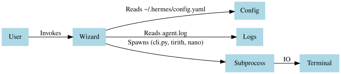
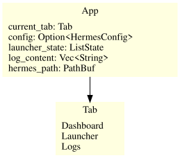
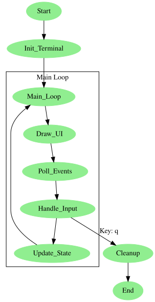
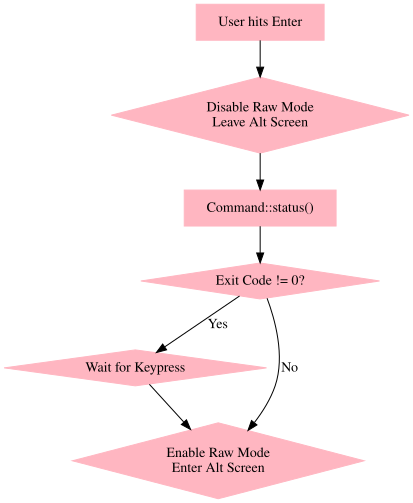
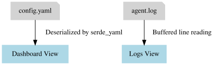

# Hermes Agent Wizard

<p align="center">
  
</p>

An interactive TUI launcher for the Hermes Agent, built with Rust and Ratatui.

## Features
- **Dashboard**: View current Hermes configuration, default model, and active toolsets.
- **Launcher**: Quickly start the interactive chat (`tirith`), edit the configuration file, or tail logs.
- **Logs**: View the last 100 lines of the Hermes agent log.

## Usage

### Shortcuts
- `Tab`: Switch between Dashboard, Launcher, and Logs.
- `↑ / ↓`: Navigate the Launcher menu.
- `Enter`: Execute the selected action in the Launcher.
- `q`: Quit the wizard.

### Running
To run the wizard:
```bash
cd hermes-agent-wizard
cargo run
```

## Architecture & Documentation

To provide a clear understanding of how the Hermes Agent Wizard operates, we've broken down its internals into five key perspectives.

### 1. System Architecture
High-level interaction between the user, the wizard, and the underlying system components.


### 2. State Management
The internal data structure (`App` struct) that drives the TUI.


### 3. TUI Lifecycle
The execution loop from terminal initialization to event handling and graceful shutdown.


### 4. Command Execution Flow
How the wizard safely suspends the TUI to hand over terminal control to external processes like `tirith` or `cli.py`.


### 5. Data Provenance
Mapping the flow of system data (config and logs) into the wizard's views.



