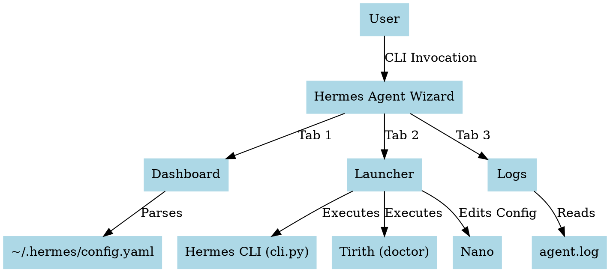
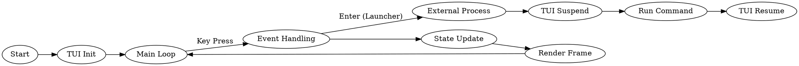

# Hermes Agent Wizard

An interactive TUI launcher for the Hermes Agent, built with Rust and Ratatui.

## Features
- **Dashboard**: View current Hermes configuration, default model, and active toolsets.
- **Launcher**: Quickly start the interactive chat (`tirith`), edit the configuration file, or tail logs.
- **Logs**: View the last 100 lines of the Hermes agent log.

## Usage

### Shortcuts
- `Tab`: Switch between Dashboard, Launcher, and Logs.
- `↑ / ↓`: Navigate the Launcher menu.
- `Enter`: Execute the selected action in the Launcher.
- `q`: Quit the wizard.

### Running
To run the wizard:
```bash
cd hermes-agent-wizard
cargo run
```

## Architecture & Flow

### System Diagram


### Wizard Logic Flow


